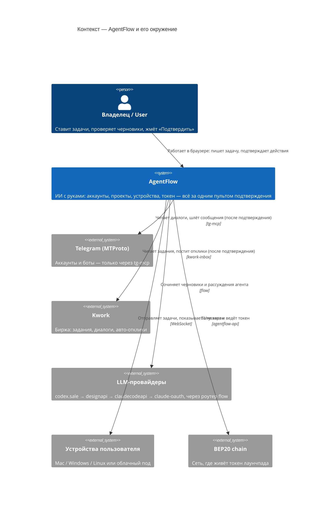
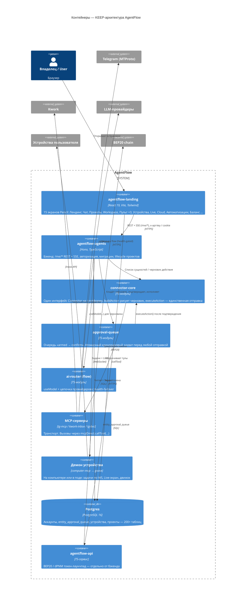
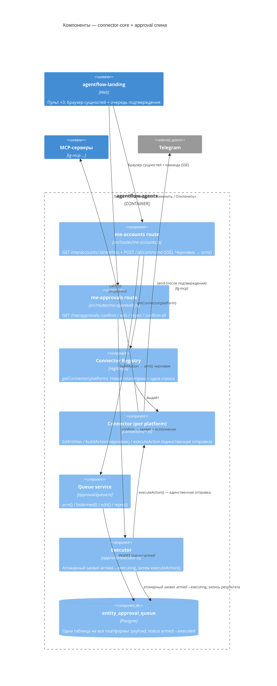

# C4 Architecture Map

## TL;DR

Это **карта того, как устроен AgentFlow**, нарисованная прямо в браузере — открываешь страницу и видишь, кто с кем связан. Никакого редактора кода. Три уровня детализации по модели **C4**: сначала «кто пользуется и с чем общается» (контекст), потом «из каких частей собран продукт» (контейнеры), потом крупный план одной несущей части — **пульт + очередь подтверждения** (компоненты).

Карта показывает **только то, что мы оставляем** (KEEP-архитектура: 15 экранов из Pencil + их бэкенд + спина connector-core/approval + устройства/движки + токен-лаунчпад). Всё, что мы скоро удаляем, тут не нарисовано.

> Те же диаграммы есть в виде модели **Structurizr DSL** в репозитории: `structurizr/workspace.dsl`. DSL — для инженеров (можно открыть на [structurizr.com](https://structurizr.com) или в Structurizr Lite). Эта страница — для просмотра в браузере без инструментов.

## Уровень 1 — Контекст: кто и с чем общается

**Человеческим языком.** Владелец заходит в AgentFlow в браузере и ставит задачу. AgentFlow — это «ИИ с руками»: он сам читает диалоги в Telegram, отвечает на Kwork, управляет твоим компьютером или облачным сервером и запускает токен. Но **ничего не отправляется в Telegram или Kwork, пока человек не нажал «Подтвердить»**. Тексты для ответов сочиняет языковая модель — AgentFlow обращается к ней через «роутер» `flow`, который сам переключается между провайдерами, если один отвалился.

## Уровень 2 — Контейнеры: из каких частей собран продукт

**Человеческим языком.** Браузерное приложение (15 экранов) — это то, что видит человек. Оно разговаривает с бэкендом `agentflow-agents`. Внутри бэкенда три ключевых блока: **connector-core** (одинаковые «переходники» к каждой платформе — Telegram, Kwork, дальше VK — без отдельного кода под каждую), **approval-queue** (очередь подтверждения: сюда складываются черновики, человек жмёт «Подтвердить», и только тогда коннектор отправляет) и **ai-router (flow)** (выбирает рабочую языковую модель). Отдельно — демон на устройстве (он же запускает движок goose), база Postgres (одна на всё) и лаунчпад токена.

Где почитать про каждую часть подробно (если страница уже есть):

- **Пульт аккаунтов** (`agentflow-landing`, 3-зонный экран) → [Cabinet «Пульт аккаунтов»](/agentflow-code-docs/subsystems/cabinet-accounts-pult)
- **ai-router / flow** → [LLM Router](/agentflow-code-docs/subsystems/llm-router)
- **MCP-серверы (Telegram)** → [Telegram MCP](/agentflow-code-docs/subsystems/tg-mcp)
- **Устройства / движок goose** → [AgentFlow Desktop (Goose fork)](/agentflow-code-docs/subsystems/agentflow-desktop-fork)
- **connector-core** и **approval-queue** — крупный план ниже (отдельные subsystem-страницы появятся в Wave 1, T1.9).

## Уровень 3 — Компоненты: пульт + очередь подтверждения (спина)

Это та самая несущая «спина», вокруг которой строятся все три экрана Пульта: **Platform → Account → EntityKind → Entity → Action → ApprovalQueue**.

**Человеческим языком.** Ты пишешь в Пульте «напиши Косте, что готово». Модель понимает: это отправка сообщения Косте. Коннектор находит Костю в диалогах и **рисует черновик** — это ещё не отправка. Черновик ложится в **очередь подтверждения** как карточка «armed» (заряжено, но не выстрелило). Ты видишь конкретный текст и адресата, жмёшь **«Подтвердить»**. Очередь делает атомарный захват (чтобы один и тот же черновик нельзя было отправить дважды), и только теперь коннектор реально отправляет в Telegram. Карточка становится «Отправлено ✓».

### Что гарантирует эта спина

- **Никакой отправки без человека.** `buildAction` рисует только черновик. `executeAction` — единственный метод с побочным эффектом, и его дёргает исполнитель **после** подтверждения.
- **Нельзя отправить дважды.** Захват `UPDATE … WHERE status='armed' RETURNING *` атомарный: повторное нажатие «Подтвердить» — пустышка (idempotent).
- **Ноль кода под платформу.** Поведение берётся из реестра (`PLATFORM_REGISTRY`), а не из `if (platform === 'telegram')`. Добавить VK = одна строка в реестре + один файл коннектора.

## Files (with line refs)

| Path | Role |
|---|---|
| `agentflow-code-docs/structurizr/workspace.dsl` | Structurizr C4 model — context / containers / components for the KEEP scope |
| `agentflow-code-docs/architecture/c4-overview.mdx` | This page — the same model embedded as Mermaid C4 |
| `agentflow-agents/src/connector-core/registry.ts` | Connector registry (per `plans/build/01-ARCHITECTURE.md` §3) |
| `agentflow-agents/src/connector-core/connectors/telegram.ts` | Telegram connector — wraps the 33 tg-mcp tools (§7) |
| `agentflow-agents/src/approval/executor.ts` | Atomic claim → `executeAction` → status write (§4) |
| `agentflow-agents/src/routes/me-accounts.ts` | Entity browse + `command` SSE (§5) |
| `agentflow-agents/src/routes/me-approvals.ts` | Approval feed + confirm/edit/reject (§5) |
| `agentflow-landing/src/pages/CabinetAccounts.tsx` | Пульт — three-zone command center |

> File refs trace `plans/build/01-ARCHITECTURE.md` §7 (module layout) and `_groundtruth-backend.md`. Some Wave-1 paths (`me-approvals.ts`, `approval/executor.ts`) are in-flight; verify line numbers against the merged code before quoting them.

## DB / Env / API

- **Tables:** `entity_approval_queue` (the spine), plus existing `platformTgAccounts`, `kworkPendingResponses` (the seed pattern), `userDevices` / `deviceTasks`.
- **Env:** routed LLM only — no model strings. The `flow` alias is configured in the ai-router, never pinned.
- **Routes:** `GET /me/accounts/:id/entities`, `GET /me/accounts/:id/entities/:eid/thread`, `POST /me/accounts/:id/command` (SSE), `GET /me/approvals`, `POST /me/approvals/:id/{confirm,edit,reject}`, `POST /me/approvals/confirm-all`.

## Failure modes

| Symptom | Log signature for grep | Where to fix |
|---|---|---|
| Mermaid block renders as raw text, not a diagram | (no error — block stays a `pre`) | Confirm `astro-mermaid` runs **before** `starlight()` in `astro.config.mjs` so Expressive Code skips the `mermaid` language |
| Confirm sends twice | `alreadyHandled` not returned | Atomic claim missing — `UPDATE … WHERE status='armed' RETURNING *` in `src/approval/executor.ts` |
| New platform needs route/UI changes | n/a (design smell) | A branch leaked outside the registry — keep behavior data-driven in `connector-core/registry.ts` |

## Related

- [Architecture Overview](/agentflow-code-docs/architecture/overview) — the 5-minute tour
- [Cabinet «Пульт аккаунтов»](/agentflow-code-docs/subsystems/cabinet-accounts-pult) — the frontend slice this map's component view backs
- [LLM Router](/agentflow-code-docs/subsystems/llm-router) — the `flow` alias + failover
- [Telegram MCP](/agentflow-code-docs/subsystems/tg-mcp) — the transport connectors wrap
- Source plans: `plans/build/00-MASTER.md` (§0 + §3.5), `plans/build/01-ARCHITECTURE.md` (the spine)
