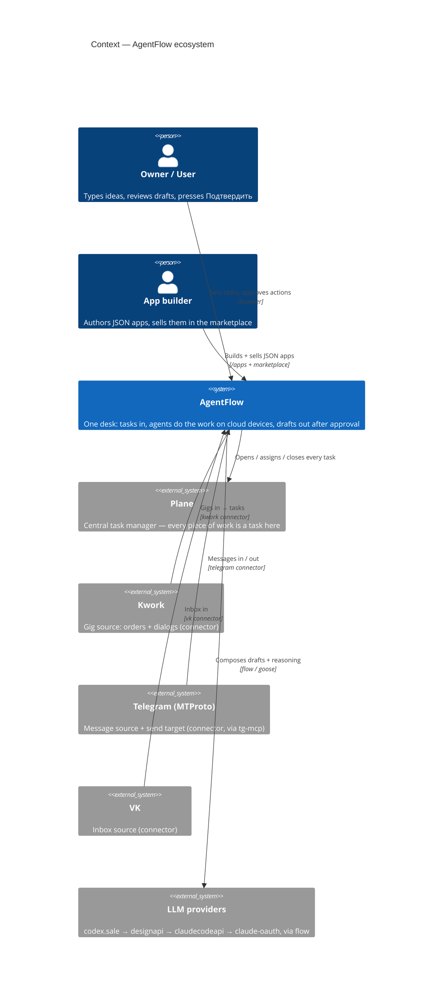
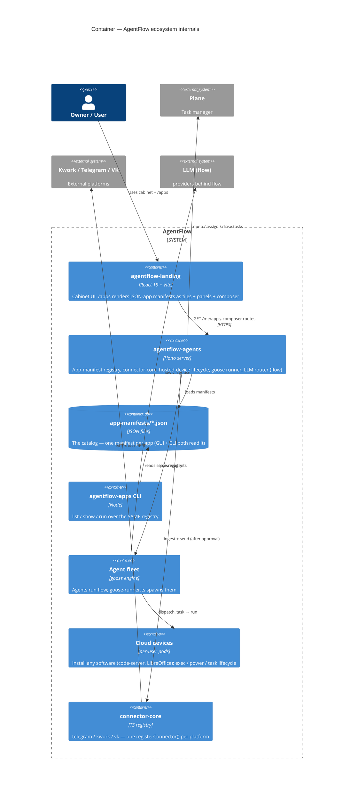

# Ecosystem overview

## TL;DR

AgentFlow is **one product seen from one angle: a task gets done.** Work arrives
from anywhere (Kwork gig, Telegram message, the owner typing an idea), lands as
a **task in Plane** (the central task manager), gets picked up by an **agent**
that runs the `flow` model through the **goose engine** on a **cloud device**,
and the task is closed when the work is verified. Every feature of the platform
is a **JSON app** (a manifest the GUI and the CLI both render), every external
service (Telegram / Kwork / VK) is a **connector packaged as an app**, and users
can **build and sell their own apps** in the marketplace. This page draws the
whole thing as one C4 picture, plain enough for a non-engineer.

For the KEEP-architecture screens-and-backend view see
[C4 Architecture Map](/architecture/c4-overview). This page is the wider
ecosystem lens (Plane + JSON-apps + fleet + marketplace) layered on top.

## Human-language version (read this first)

Imagine a single desk. On the left is an **inbox of tasks** — some you typed
yourself, some came in from a Kwork order, some from a Telegram chat. On the
right is a **crew of robots** (agents). Each robot has the same brain (the
`flow` model) but can pick up any task, sit down at a **computer in the cloud**
(a pod that can install VS Code, LibreOffice, a browser — anything), do the
work, show you a draft, and — only after you press **Подтвердить** — send it
out. Every tool on that desk (the account console, the queue, the chat, the
token launcher) is the **same kind of thing**: a small JSON file that describes
what it does. That is the whole system. Nothing is special-cased.

## The seven pillars

| # | Pillar | What it is | Grep anchor |
|---|---|---|---|
| 1 | **Task manager (Plane)** | Every piece of work — a client order, a dev ticket, an agent's sub-step — is a **task** in Plane. One inbox, one source of truth, one place a task is opened/assigned/closed. | target system (greenfield — see Gaps) |
| 2 | **Everything is a JSON app** | One `AppManifest` JSON drives both a generic GUI and the CLI/API. Schema + loader/registry + CLI + `/me/apps` route. | `agentflow-agents/src/app-manifests/schema.ts:122` |
| 3 | **Agent fleet on `flow`** | A crew of agents, all running the platform `flow` alias through the **goose** engine adapter. No hardcoded model. | `agentflow-agents/src/coder-shim/goose-runner.ts:27` |
| 4 | **Cloud devices** | Per-user pods that can install any software (code-server / VS Code, LibreOffice, browsers) and run agent tasks. Exec / power / re-enroll lifecycle. | `agentflow-agents/src/routes/me-hosted-devices/lifecycle.ts:114` |
| 5 | **Connectors as apps** | Telegram / Kwork / VK are connectors behind `connector-core`; each is exposed to users as a JSON app's `uses.connectors`. | `agentflow-agents/src/connector-core/registry.ts:13` |
| 6 | **ChatGPT-style composer** | One input box that routes a typed line into a **mode** of the active app. | `agentflow-agents/src/app-manifests/schema.ts:90` (`composerSchema`) |
| 7 | **Marketplace** | Apps carry a `pricing: free | premium` tier; users build apps and sell them. | `agentflow-agents/src/app-manifests/schema.ts` (`pricing` field) |

---

## Pillar 1 — The task manager (Plane)

Everything that happens on AgentFlow is **a task**. Plane is the chosen central
task manager: one board where a Kwork order, a Telegram follow-up, an owner's
brief, and an agent's internal sub-step all live as rows. A task has a source,
an assignee (an agent or a human), a state, and a close condition.

Today the platform already persists work-like rows in several tables
(`plan_tasks` in `agentflow-agents/src/db/schema/plans.ts:56`, `device_tasks`
driven by [Device Task Lifecycle](/subsystems/device-task-lifecycle),
`project_events`, `autonomous_goals` in
`agentflow-agents/src/db/schema/autonomous.ts:30`). The ecosystem move is to
**funnel all of these into Plane as the one inbox** so a person and an agent
look at the same board. Until that sync ships, Plane is the target (see Gaps).

## Pillar 2 — Everything is a JSON app

A feature is not bespoke code wired into the GUI. It is an **`AppManifest`** — a
JSON document that declares identity, the modes it offers, the
connectors/MCP-tools/engine it leans on, the panels the GUI renders, its pricing
tier, and the CLI commands it exposes. The platform renders the **same manifest
two ways**: a generic GUI and a CLI/API.

| Path | Role |
|---|---|
| `agentflow-agents/src/app-manifests/schema.ts:122` | `appManifestSchema` — zod schema for the manifest (`.passthrough()` = forward-compatible). |
| `agentflow-agents/src/app-manifests/schema.ts:159` | `validateManifest()` — tagged result, skips a bad file instead of throwing. |
| `agentflow-agents/src/app-manifests/registry.ts:13` | Loads `app-manifests/*.json` from disk into a slug→manifest map (the registry IS the data). |
| `agentflow-agents/src/routes/me-apps.ts:25` | `GET /me/apps` + `GET /me/apps/:slug` — HTTP catalog over the registry. |
| `agentflow-agents/src/cli/agentflow-apps.ts:1` | `agentflow-apps list|show|run` — CLI over the **same** registry (proves GUI+CLI parity). |
| `agentflow-agents/app-manifests/accounts-pult.json:1` | First example manifest — the accounts Пульт expressed as a JSON app. |
| `agentflow-landing/src/pages/AppsLauncher.tsx:1` | The `/apps` renderer surface in the cabinet (iOS-home-screen launcher of app tiles). |

A manifest's shape (from `schema.ts`): `modes[]` (a thing the app does, optional
`prompt_preset`), `uses{connectors, mcp_tools, engine}`, `panels[]` (generic UI
surfaces, open `type` so new kinds need no schema bump), `composer{placeholder,
routes}`, `cli[]`, and `pricing: 'free' | 'premium'`. **No per-app branching in
code** — adding an app = adding a JSON file.

## Pillar 3 — The agent fleet on `flow` (goose engine)

Every agent runs the platform model alias **`flow`** through the **goose**
engine adapter — never a concrete model id. Goose talks to an OpenAI-compatible
facade at `<host>/_agents/llm/v1/chat/completions`; the gateway's
`pickFlowUpstream` resolves `flow` to whatever upstream is healthy (codex.sale →
designapi → claudecodeapi → claude-oauth).

| Path | Role |
|---|---|
| `agentflow-agents/src/coder-shim/goose-runner.ts:27` | `buildGooseConfig()` — renders `~/.config/goose/config.yaml`, `GOOSE_MODEL` = the `flow` alias. |
| `agentflow-agents/src/coder-shim/goose-runner.ts:337` | `buildGooseArgs()` — model comes from config.yaml so there is one source of truth, no hardcode. |
| `agentflow-agents/src/coder-shim/goose-runner.ts:433` | `runGoose()` — spawns goose for the coder-brief path. |

The fleet is uniform: same brain, many bodies. An agent does not own a model — it
routes through `useModel`/`flow`, so swapping the engine or upstream is a config
change, not a code change.

## Pillar 4 — Cloud devices (install any software)

A cloud device is a **per-user pod** the agent sits down at. It can install any
software — code-server / VS Code in the browser, LibreOffice, a browser — and
run agent tasks against it. The lifecycle is owner-scoped (it runs inside the
user's vcluster, no cross-tenant exec).

| Path | Role |
|---|---|
| `agentflow-agents/src/routes/me-hosted-devices/lifecycle.ts:114` | `POST /me/hosted-devices/:id/exec` — one-shot exec in the pod (`apt-get install`, `curl`, etc.). |
| `agentflow-agents/src/routes/me-hosted-devices/lifecycle.ts:176` | `POST /me/hosted-devices/:id/power` — scale 0/1 + rollout restart. |
| `agentflow-agents/src/routes/me-hosted-devices/lifecycle.ts` (`reenroll`) | rotate the pod's enrollment token. |
| Tasks onto a device | [Device Task Lifecycle](/subsystems/device-task-lifecycle) — `dispatch_task` → WS / queued → daemon loop → session accounting. |

This is the muscle of the system. The heavy lifting (build, browser, IDE) happens
in the cloud, not on the owner's machine. See the dogfooding runbook for moving
AgentFlow's **own** development onto these pods:
[Cloud-dogfooding migration](/runbooks/cloud-dogfooding-migration).

## Pillar 5 — Connectors as apps

Telegram, Kwork, and VK are not three special integrations — they are
**connectors** behind one registry, and each surfaces to users as a JSON app's
`uses.connectors`. Adding a platform = one `registerConnector(...)` line plus one
connector file. No route, UI, or schema change, and **never** an
`if (platform === …)` outside the registry.

| Path | Role |
|---|---|
| `agentflow-agents/src/connector-core/registry.ts:13` | `registerConnector()` / `getConnector()` — the only place a platform id binds to a connector. |
| `agentflow-agents/src/connector-core/bootstrap.ts:21` | registers `telegram`, `kwork`, `vk`. |
| `agentflow-agents/src/connector-core/connectors/telegram.ts` | Telegram connector (MTProto via tg-mcp). |
| `agentflow-agents/src/connector-core/connectors/kwork.ts:58` | Kwork connector (`kworkDef`, parse wants/dialogs/gigs/thread). |
| `agentflow-agents/src/connector-core/connectors/vk.ts` | VK connector. |
| `agentflow-agents/app-manifests/accounts-pult.json` | `uses.connectors: ["telegram","kwork","vk"]` — connectors consumed by an app. |

See [connector-core](/subsystems/connector-core) for the deep dive.

## Pillar 6 — The ChatGPT-style composer

The composer is the app's single input box. A typed line is matched against the
manifest's `composer.routes` and switches the app into the right **mode**. One
box, many modes — the same feel as a ChatGPT prompt that picks a tool.

From `accounts-pult.json`: `"^/queue" → queue` mode, `"^/rule" → automate` mode.
The schema is `composerSchema` at
`agentflow-agents/src/app-manifests/schema.ts:90` (`routes[]` of
`{match, mode}`). The composer never hardcodes behavior — it routes into a mode
the manifest declared.

## Pillar 7 — Marketplace (free / premium, users build + sell)

Every manifest carries `pricing: 'free' | 'premium'`
(`agentflow-agents/src/app-manifests/schema.ts`, `pricing` field on
`appManifestSchema`). Because an app is just a JSON manifest plus the
connectors/engine it `uses`, **a user can author an app and list it** — free or
premium — in the marketplace. The platform renders any well-formed manifest, so
a third-party app gets the same GUI + CLI surface as a shipped one. No code review
gate is needed for the renderer; validation is the schema.

---

## How a task flows (end to end)

```
SOURCE                 TASK MANAGER        FLEET            CLOUD DEVICE        CLOSE
(kwork / telegram /   →  Plane task     →  agent picks  →  runs flow/goose  →  verify →
 owner brief / any)      (one inbox)        it up           on a pod            close task
```

Concretely:

1. **Source** — a Kwork gig arrives via the kwork connector, or a Telegram
   message via the telegram connector, or the owner types an idea into the
   composer. (`connector-core/connectors/*` ingest; composer routes a brief.)
2. **Plane task** — the inbound item becomes a task in Plane: source, assignee,
   state, close condition. (Target — today rows land in `plan_tasks` /
   `device_tasks` / `project_events`; see Gaps.)
3. **An agent picks it up** — a fleet agent claims the task and loads the matching
   app's mode (`prompt_preset`) and `uses` (connectors + engine).
4. **Runs on a cloud device** — the agent sits down at a per-user pod, installs
   what it needs, runs `flow` through goose, produces a draft / artifact.
5. **Approve gate** — nothing goes out to Telegram/Kwork until the owner presses
   **Подтвердить** (the approval queue / Пульт). The draft is a manifest `panel`.
6. **Close the task** — on verified completion the task in Plane is closed; the
   device session records `tokens_used` + `cost_usd`
   ([Device Task Lifecycle](/subsystems/device-task-lifecycle)).

## C4 — Context



## C4 — Container



## DB / Env / API

- **Tables (today):** `plan_tasks` (`src/db/schema/plans.ts:56`), `device_tasks`,
  `project_events`, `autonomous_goals` (`src/db/schema/autonomous.ts:30`).
  **Target:** Plane as the single task store (sync, not replace — see Gaps).
- **Routes:** `GET /me/apps`, `GET /me/apps/:slug`
  (`src/routes/me-apps.ts:25`); `POST /me/hosted-devices/:id/exec|power`
  (`src/routes/me-hosted-devices/lifecycle.ts:114`); device `dispatch_task`
  (see Device Task Lifecycle).
- **CLI:** `agentflow-apps list | show <slug> | run <slug> [mode]`
  (`src/cli/agentflow-apps.ts:1`).
- **Model alias:** `flow` only — resolved by gateway `pickFlowUpstream`. Never a
  concrete model id (`useModel` discipline).
- **Connectors:** registered in `src/connector-core/bootstrap.ts:21`.

## Failure modes

| Symptom | Log signature for grep | Where to fix |
|---|---|---|
| App missing from `/me/apps` | `app_not_found` | `agentflow-agents/src/routes/me-apps.ts:33` |
| Manifest silently dropped from catalog | (logged skip in loader) | `agentflow-agents/src/app-manifests/registry.ts` (`loadManifestsFromDir`) |
| Connector call with unknown platform | `connector_not_registered` | `agentflow-agents/src/connector-core/registry.ts:18` |
| Goose run uses wrong model | `GOOSE_MODEL` not `flow` in config.yaml | `agentflow-agents/src/coder-shim/goose-runner.ts:30` |
| Cross-tenant device exec attempt | (scoped to user vcluster — no cross-tenant exec) | `agentflow-agents/src/routes/me-hosted-devices/lifecycle.ts:110` |

## Related

- [C4 Architecture Map](/architecture/c4-overview) — KEEP screens + backend
- [connector-core](/subsystems/connector-core) — platform registry deep dive
- [Device Task Lifecycle](/subsystems/device-task-lifecycle) — dispatch → run → close
- [Cloud-dogfooding migration](/runbooks/cloud-dogfooding-migration) — move AF's own dev to the server
- [Dependency Map](/architecture/dependency-map) — module graph of agentflow-agents
